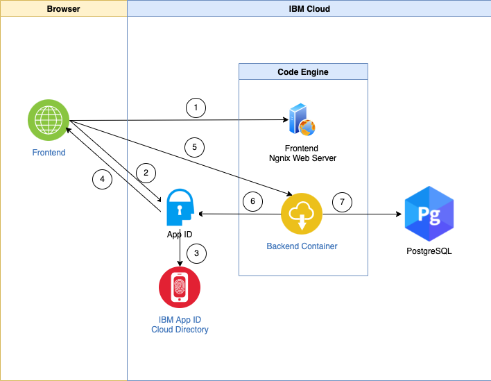

# Authentication Flow (AppID, backend, frontend)

The following diagram display a simplified authentication flow in the serverless environment.
The numbering visualizes the simplified invocation sequence.

1. The web application URL is invoked by an user in the browser and the browser loads the web application from the Nginx server.
2. The web application redirects the user to the App ID login page and he inserts his ID and password.
3. App ID validates the user and the application invocation.
4. App ID provides an `id token` and `access token` in a JWT format.
5. The web application uses the `access token` to invoke the secured backend endpoint.
6. The backend verifies if the token is valid.
7. The backend access securely the Postgres database with a user, password and certificate information. 