# Create DevSecOps pipelines to update a Kubernetes application 

DevSecOps integrates a set of security and compliance controls into the DevOps processes, allowing frequent code delivery while maintaining a strong security posture and continuous state of audit-readiness.

This setion steps you through the creation of Continuous Integration (CD) toolchains using an IBM Cloud toolchain templates, which we will customize to deploy the sample application to an IBM Cloud Kubernetes cluster.

### Before you begin

Set up the following pre-requisites:

- Ensure you have cloned the following repos to your GitHub account:

* https://github.com/IBM/multi-tenancy
* https://github.com/IBM/multi-tenancy-backend
* https://github.com/IBM/multi-tenancy-frontend

- An instance of the IBM Cloud Secrets Manager service (the same one you used for CI pipelines)
- An IBM Cloud Kubernetes Service cluster or an IBM Cloud OpenShift cluster (the same one you used for CI pipelines)
- Create a namespace in the IBM Cloud Container Registry (the same one you used for CI pipelines)

### Create the toolchain

Click `Create Toolchain` and select the `DevSecOps` filter:

### Create CD toolchain

Click the `CD` tile to launch the setup wizard, and complete the fields by refering to the following screenshots (refering to your own GitHub repos):

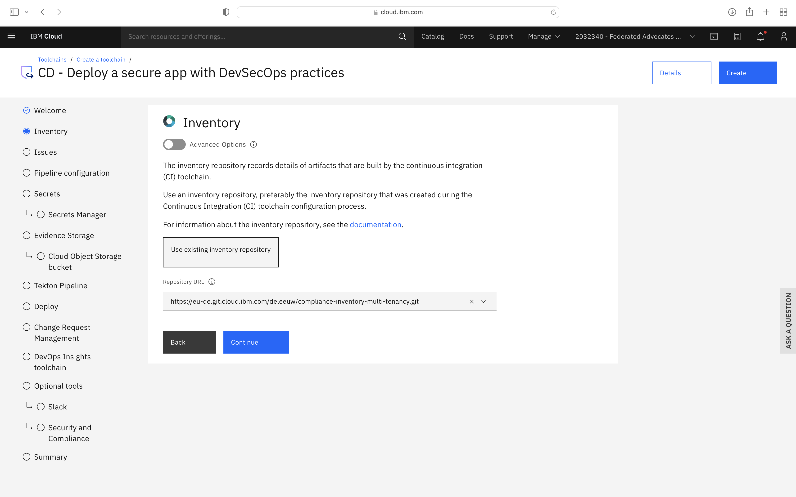

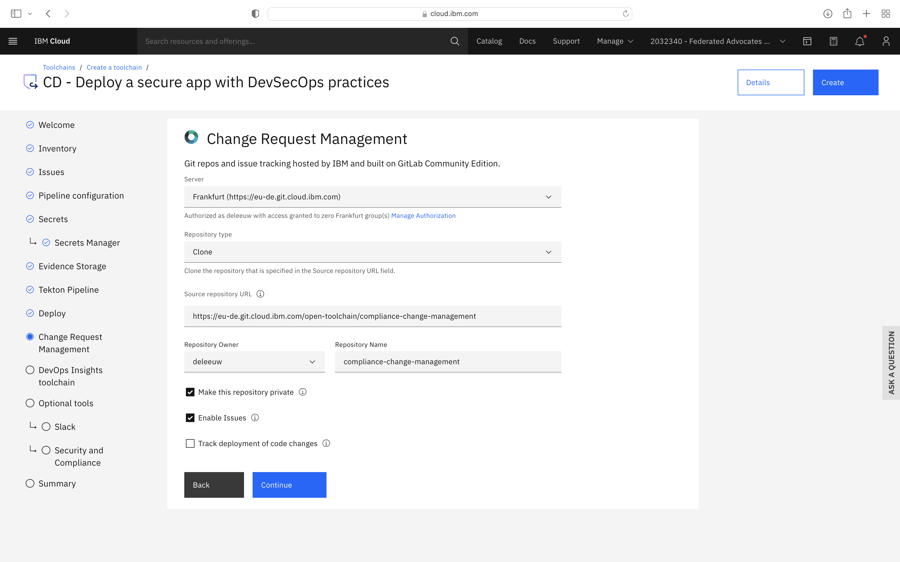
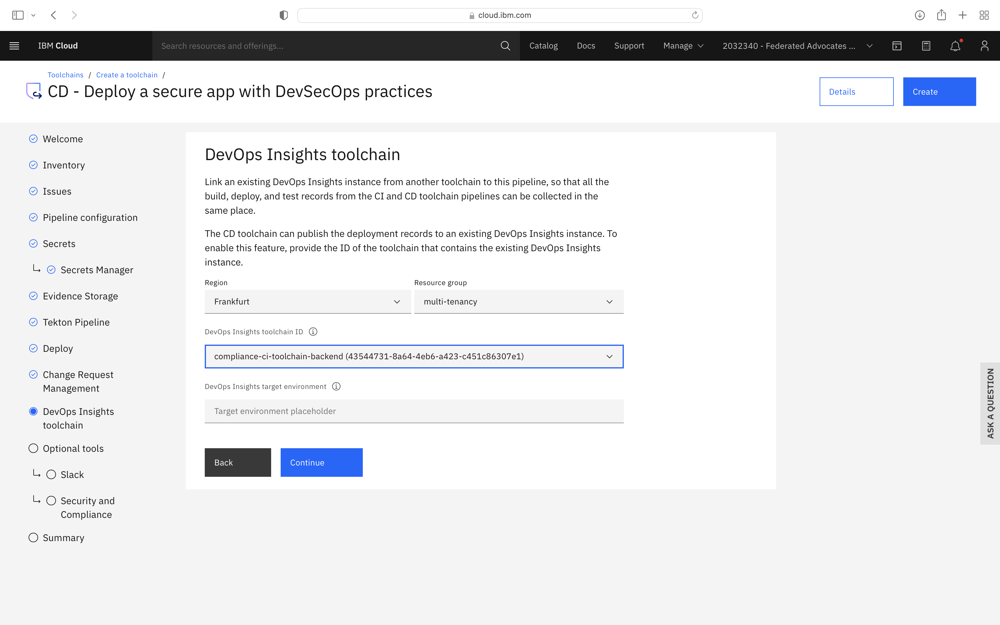
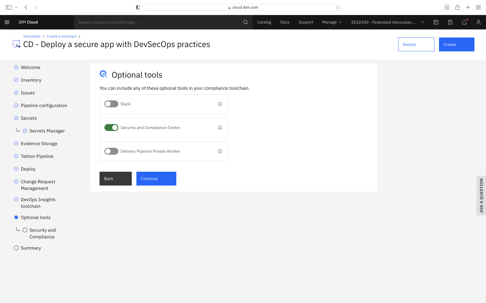

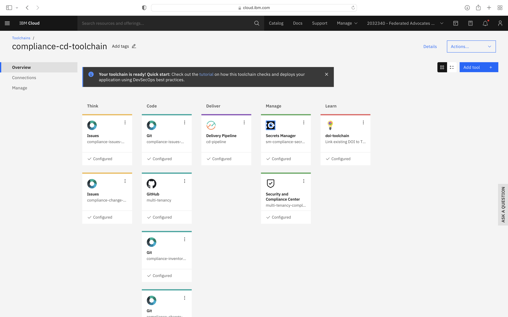

### Create Dev Mode trigger & Update Environmental Properties for CD

The environmental properties for the CD pipeline should be updated as follows (using your own GitHub multi-tenancy/backend/frontend repos):

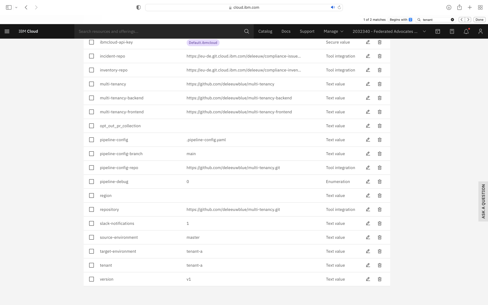

Note that the Text fields `pipeline-config-branch` and `target-environment` were updated.

Additional Text Fields entitled `branch`, `multi-tenancy-frontend`, `multi-tenancy-backend`, `multi-tenancy` and `tenant` were added.

An additional Tool Integration field entitled `repository` was added.  When setting this field, you must specify a JSON filter of `parameters.repo_url`.

Select the `Trigger` tab.  You may need to correct the Git CD Trigger if it shows a hazard symbol:

Edit its properties and select a valid the branch name:

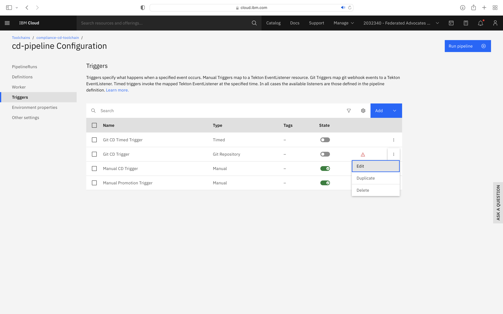

Also, copy the existing `Manual CD Trigger` and use it to create a `Manual CD Trigger force redeploy` trigger which can be used to bypass some elements of the toolchain, for testing purposes.  Note that two properties have been added:

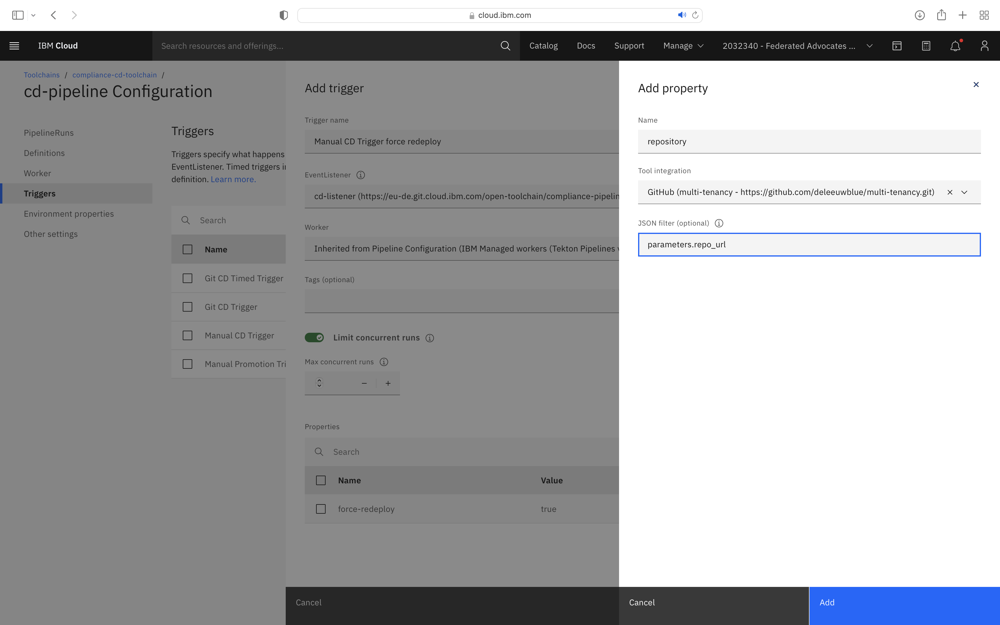

### Testing the CD pipeline (Optional)

In this section, you can make a quick test of the CD pipeline.  For a more detailed explanation of how to use the pipelines to onboard a new tenant, see the [Observability]() section.

First you'll need to execute the `Manual Promotion Trigger`.  This creates a new branch and a merge request in the GitLab Inventory Repository.  You should approve that merge request before proceeding.  You can find a link to the merge request in the output of the pipeline run:

             

Essential information must be added to the merge request.  Click the `Edit` button and complete the `Change Request assignee` and `Priority` as follows, then `Save Changes`:

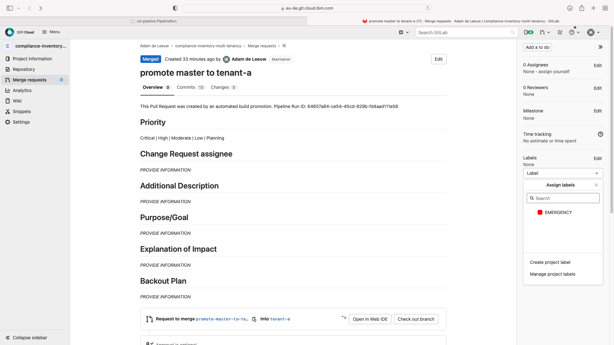
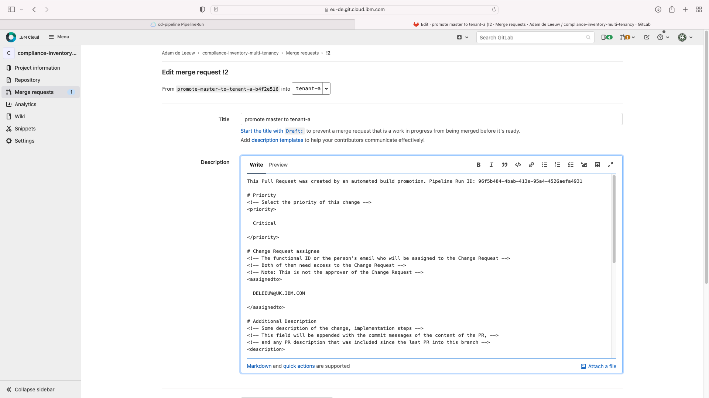

You may also create an `EMERGENCY` label on the right hand panel, but you do not need to assign the label to this merge request, although it may be useful in future.

Approval is optional, simply press the blue `Merge` button.

You can now trigger the pipeline with a `Manual CD Trigger`.  Click the pipeline run name to view the progress.  After a few minutes, a successful result should look like this:

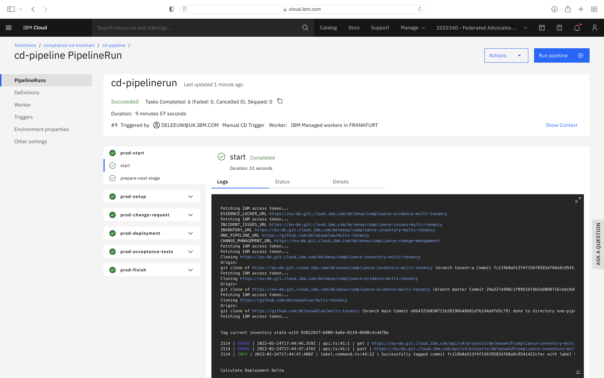

In the logs for the `prod-deployment` `run-stage` you will find two outputs starting `Application URL:`.  These are the URLs to test the backend and frontend applications.  Give them a try!  (The username and password to login to the frontend is User: thomas@example.com. Password: thomas4appid)

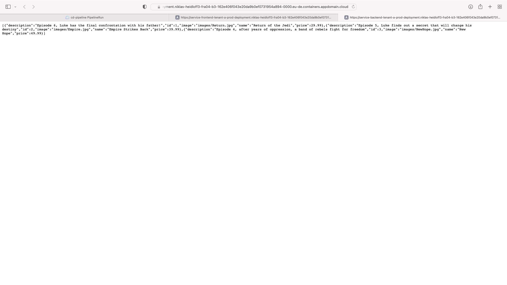
